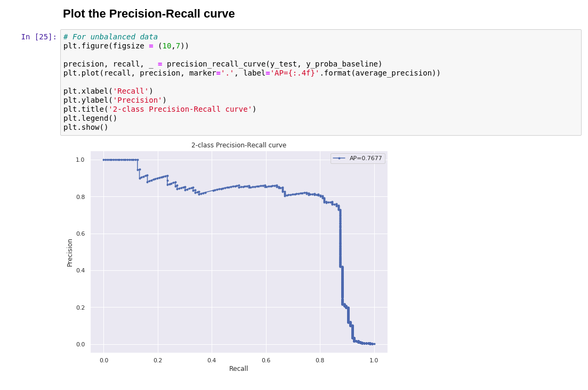

== Build Your First Model

In this module, you will begin to use Jupyter Notebook to build, train
and test the model.

== Logging in

Begin by logging into link:{{JUPYTERHUB_URL}}[JupyterHub^].

Your user name will be `{{  USER_ID }}` and password is
`{{  OPENSHIFT_USER_PASSWORD }}`.

Upon logging in, start a new notebook by choosing
`rh-mlops-workshop-notebook:3.6` image in the drop down box and then click on
`Spawn`. Leave the rest of the options as default.

[NOTE]
====
If the notebook page did not appear, try refreshing the page or reach
out to your instructor.
====

Once the notebook page is up and running, click on
`{{USER_MODEL_REPO_NAME}}/notebooks/2 building the first model.ipynb` to load the notebook.

After running notebook “2 building the first model”, the output would be similar to the example below.

== Links

* link:kubernetes-overview.adoc[1. Kubernetes Overview]
* link:navigating-openshift-ui.adoc[2. Navigating OpenShift Web Console]
* link:getting-started-mlops.adoc[3. Getting Started with MLOps]
* link:workshop-environment.adoc[4. Your Workshop Environment]
* link:exploring-data.adoc[5. Exploring Data]
* link:building-the-first-model.adoc[6. Build the First Model]
* link:productize-the-model.adoc[7. Productize the Model]
* link:deploy-to-staging.adoc[8. Deploy The Model To Staging]
* link:promote-to-production.adoc[9. Promote to Production]
* link:model-observability.adoc[10. Model Monitoring and Observability]
* link:continuous-training.adoc[11. Continuous Training With A/B Testing]
* link:decide-on-final-model.adoc[12. Deploy The Chosen One]
* link:integrate-with-application-services.adoc[13. Completing the Solution with Red Hat Application Services]
