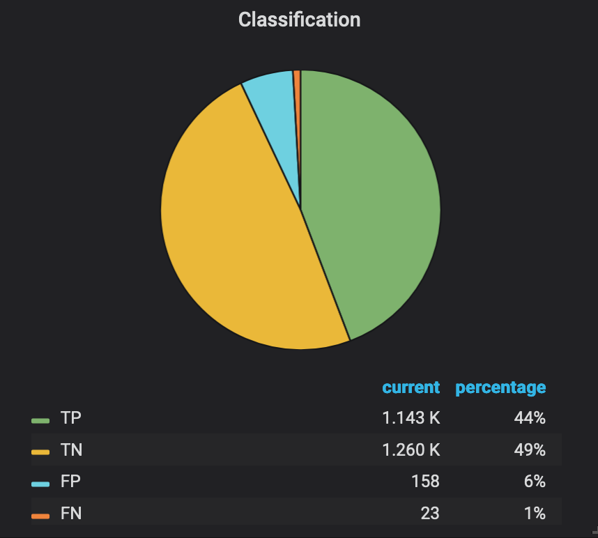

## Observing The Performance Of Both Models

Run the following script to send sufficient transactions to the models. 

[source,sh,role="copypaste"]
----
/projects/{{USER_MODEL_REPO_NAME}}/bin/prod-mon-test.sh
----

Now look at the Grafana {{GRAFANA_URL}}[dashboard^], and see that the Recall score, TP / (TP + FN), for XGBoost is better compared to Logistic Regression. 

Choose your image and namespace `{{USER_ID}}-prod` and view the metrics from your model.

:figure-caption!:

[.float-group]
--
[.text-center]
.Logistic Regression

.XGBoost

--

## Deploying The Chosen One

Let's quickly change the `SeldonDeployment` to use XGBoost, deploy to staging and promote it to Production.

[source,sh,role="copypaste"]
----
cd /projects/{{USER_MODEL_REPO_NAME}}
git checkout master
GIT_REV=`git rev-parse --short HEAD`
echo "GIT REVISION: $GIT_REV"
. src/seldon/config.sh

cd /projects/{{USER_DEPLOY_REPO_NAME}}
git checkout master
sed -e "s/_USER_/{{USER_ID}}/g" -e "s/_CONTAINER_REGISTRY_/$NEXUS_DOCKER_REGISTRY/g" -e "s/_IMAGE_NAME_/$IMAGE_NAME/g" -e "s/_GIT_REV_/$GIT_REV/g" seldon-model.yaml.tmpl > seldon.yaml
git commit -a -m "Update image tag to $IMAGE_NAME:$GIT_REV"

git checkout stage
git merge master

git checkout prod
git merge stage

git push -u -v origin
----

Observe that only a single classifier has been deployed.

After the final model has been deployed to OpenShift, you can run some basic tests.
[source,bash,role="copypaste"]
----
/projects/{{USER_MODEL_REPO_NAME}}/bin/prod-test.sh
----

## Tag It!

Great! The new XGBoost model is working better and we now can tag it as `v2.0`

[source,sh,role="copypaste"]
----
cd /projects/{{USER_MODEL_REPO_NAME}}
git checkout stage
git tag -a v2.0 -m "v2.0"
git push -v origin v2.0
----

The tag has now been pushed to {{GIT_URL}}/{{USER_ID}}/{{USER_MODEL_REPO_NAME}}/src/v2.0[your^] git
repository.

== Links

* link:kubernetes-overview.adoc[1. Kubernetes Overview]
* link:navigating-openshift-ui.adoc[2. Navigating OpenShift Web Console]
* link:getting-started-mlops.adoc[3. Getting Started with MLOps]
* link:workshop-environment.adoc[4. Your Workshop Environment]
* link:exploring-data.adoc[5. Exploring Data]
* link:building-the-first-model.adoc[6. Build the First Model]
* link:productize-the-model.adoc[7. Productize the Model]
* link:deploy-to-staging.adoc[8. Deploy The Model To Staging]
* link:promote-to-production.adoc[9. Promote to Production]
* link:model-observability.adoc[10. Model Monitoring and Observability]
* link:continuous-training.adoc[11. Continuous Training With A/B Testing]
* link:decide-on-final-model.adoc[12. Deploy The Chosen One]
* link:integrate-with-application-services.adoc[13. Completing the Solution with Red Hat Application Services]
